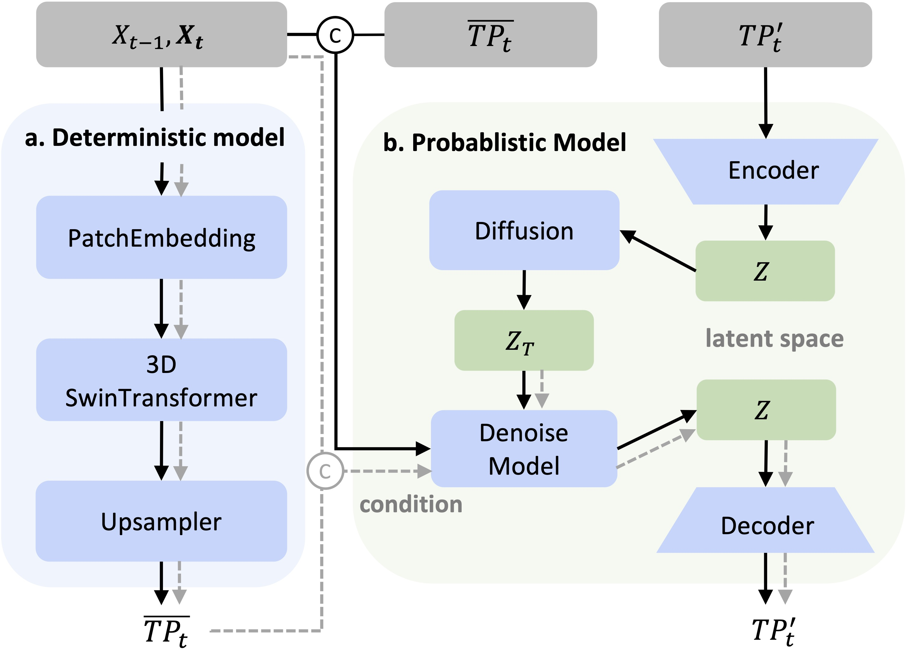

# HREPNet: High-Resolution Ensemble Precipitation Network

This is the repository of a deep learning framework for high-resolution ensemble precipitation forecasting.

[HREPNet: Skillful High-Resolution Ensemble Precipitation Forecasting with an Integrated Deep Learning Framework](https://arxiv.org/abs/2501.02905), arXiv preprint: 2501.02905, 2025.

*by Shuangshuang He, Hongli Liang, Yuanting Zhang and Xingyuan Yuan

## Overview


HREPNet is trained on ERA5 and CMPA high-resolution precipitation datasets, taking coarse-resolution (0.25°) atmospheric variables (temperature, pressure, humidity, geopotential, and wind) as inputs to generate high-resolution precipitation forecasts.

## Model Architecture


Based on the assumption that high-resolution precipitation consists of meso-scale average precipitation and sub-grid scale residual precipitation, HREPNet employs a novel two-component architecture:

1. **Deterministic Model**:
   - Based on 3D SwinTransformer architecture
   - Captures average precipitation at mesoscale resolution


2. **Probabilistic Model**:
   - Employs conditional diffusion in latent space
   - Accounts for uncertainties in residual precipitation at convective scales
   - Generates ensemble members through latent variable sampling

## Getting Started

Instructions for setting up and running the project will be added soon. The pre-trained model weights will also be made publicly available.

## Data Sources

- **ERA5 Reanalysis Data**: Global atmospheric reanalysis data
- **CMPA Data**: China Merged Precipitation Analysis data

## Code Attribution

Parts of the code in this repository are adapted from the following sources:

- `src/models/ldm/`: adapted from [CompVis/stable-diffusion](https://github.com/CompVis/stable-diffusion/tree/main/ldm)
- `src/models/diffusion/`: adapted from [facebookresearch/DiT](https://github.com/facebookresearch/DiT/blob/main/diffusion)

We thank the original authors for their open-source contributions.

## Citation

If you use this code in your research, please cite our paper:

```bibtex
@article{hess2025hrepnet,
   title={Skillful High-Resolution Ensemble Precipitation Forecasting with an Integrated Deep Learning Framework}, 
      author={Shuangshuang He and Hongli Liang and Yuanting Zhang and Xingyuan Yuan},
      year={2025},
      eprint={2501.02905},
      archivePrefix={arXiv},
      primaryClass={cs.LG},
      url={https://arxiv.org/abs/2501.02905}, 
}
```

## License
HREPNet was released by ColorfulClouds Technology Co.,Ltd.

Also, please note that all models were trained using the ERA5 dataset provided by ECMWF. Please do follow [their policy](https://apps.ecmwf.int/datasets/licences/copernicus/).


## Contact
For questions and collaborations, you can:

* Open an issue in this repository
* Contact the authors directly:
    * Shuangshuang He: heshuangshuang@caiyunapp.com
    * Yuanting Zhang: zhangyuanting@caiyunapp.com

We welcome feedback, questions, and potential collaboration opportunities.